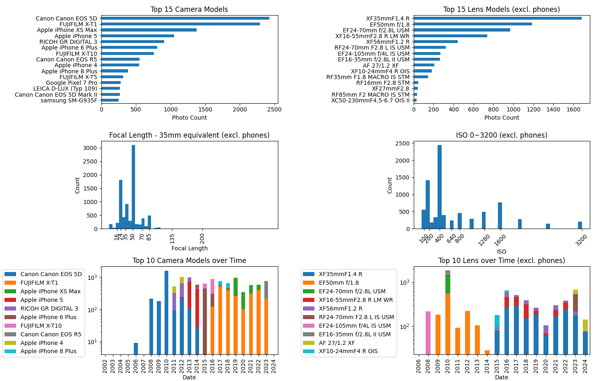

# photo-histogram
Statistics of photos in Apple Photo on Mac OS

# Usage

1. In Apple Photo, you may need to download Originals. 

   Apple Photo -> Settings -> iCloud tab -> Select 'Download and Keep Originals'.

2. Install [Homebrew](https://brew.sh)

3. Install [miniconda](https://formulae.brew.sh/cask/miniconda) with Homebrew

4. Install required packages

```
$ brew install exiftool
$ cd [path-to-this]
$ pip install -r requirements.txt
```

5. Run it

```
$ python photo-histogram.py
```

Mac OS may ask you to grant access of your Apple Photo Library to the
Terminal app.



The tool provides histogram of camera models, lens models, focal lengths and ISO. 
